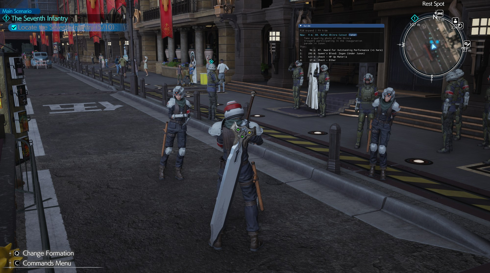
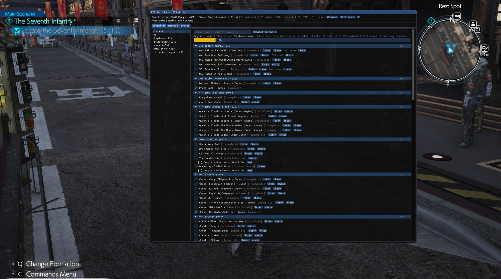
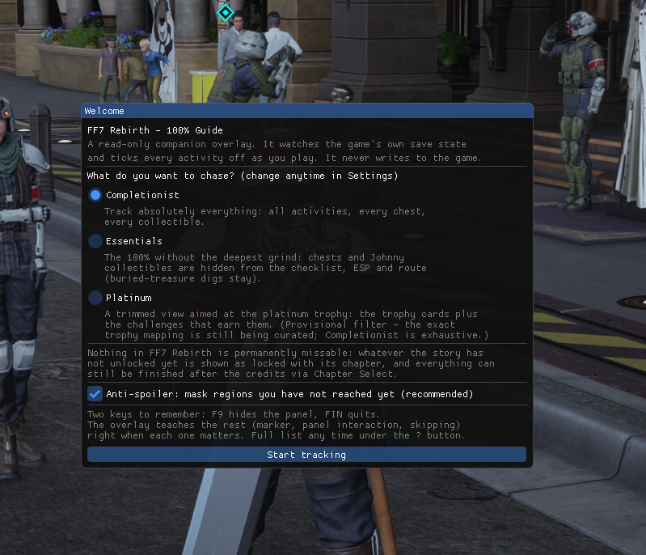

# FF7 Rebirth Completion Guide Overlay

Chasing 100% in FF7 Rebirth means alt-tabbing to checklists every ten
minutes. This little overlay fixes that: it watches your own game, ticks
things off **live** as you complete them, and points a marker at whatever
is closest that you still haven't done. It only ever *reads* — it can't
touch your game, your saves, or the internet.

-blue)

## Download

**[Latest release](https://github.com/granbauti/FF7RebirthGuide/releases/latest)** — grab the `.zip`, then:

1. Extract it to a normal folder (not inside the zip).
2. Set the game to **Borderless** (Settings > Graphics > Display Mode).
3. Start the game, run `FF7RebirthGuide.exe`.
4. If SmartScreen warns: "More info" > "Run anyway" — and see
   [TRUST.md](TRUST.md) for how to verify the download yourself.



*This collectible is easy to walk right past — the guide points at the exact
NPC, tells you what to do, and ticks it off the moment the game registers it.*



*The checklist opens on what you can actually do here and now. Search anything,
or hit "Completion audit" for the full game-wide list of what's left.*



*First run: pick what you're chasing and play. The overlay teaches its keys as
you go.*

## What it does

- **Tracks everything, live** — quests, chests, all the World Intel
  (towers, fiend sightings, lifesprings, protorelics, moogles...),
  Queen's Blood, Chadley's VR challenges, minigames, Johnny's collectibles
  and the trophy cards. The moment the game registers your progress, the
  overlay ticks it off. 1,098 things in total.
- **Points the way** — a marker in the world shows the nearest thing you
  haven't done, with the distance and a short hint of what to do there.
  If fast travel would save you a long walk, it says so. Things you can do
  at several places (Chadley's simulator, the pianos) point to the closest
  one.
- **Knows what unlocks what** — pick any goal, hit "chase", and it walks
  the requirements back to the thing you can actually do *right now*. If
  something is story-locked it tells you the chapter instead of sending you
  somewhere useless.
- **Find anything** — a search box filters all 1,098 items as you type,
  and a one-click "Completion audit" lists everything you're still missing,
  ready to copy as text.
- **No spoilers** — names of regions you haven't reached stay hidden until
  you get there (on by default, can be turned off).

## What it never does

It opens the game with read-only access — the same way a debugger *looks*
at a program without touching it. That's the whole trick, and it means:

- No writes to the game's memory. Ever. It physically can't cheat for you.
- No injected code, no DLLs, no mods — nothing runs inside the game.
- No changes to game files or saves.
- No internet. The overlay makes zero network connections (the "check for
  updates" button just opens this page in your browser).

If your game version doesn't exactly match the supported one, the overlay
refuses to start rather than risk showing you wrong information.

Supported version: **Steam build 23447986 (PC 1.005)**.

## Compatibility

- **CPU**: any 64-bit Intel or AMD processor (no special instruction sets
  required).
- **GPU**: anything with DirectX 11 support — NVIDIA, AMD or Intel
  integrated graphics all work. The overlay is lightweight.
- **OS**: Windows 10 or 11, 64-bit.
- **Dependencies**: none. Single self-contained executable — no Visual C++
  redistributable, no installer.
- **Display mode**: run the game in **Borderless** (or Windowed) mode so
  the overlay can draw on top. In exclusive Fullscreen the overlay may not
  be visible.

## Usage

1. Start FINAL FANTASY VII REBIRTH (Borderless recommended).
2. Run `FF7RebirthGuide.exe`. It finds the running game automatically —
   you can also start the overlay first; it waits for the game. A
   minimized console window appears in the taskbar (the overlay's log);
   closing that window also quits the overlay.
3. On first run a small wizard lets you pick a guide mode.
4. Play.

### Hotkeys (all rebindable in Settings)

| Key | Action |
|---|---|
| **F6** | Skip the currently marked target (turn the marker off and on to bring skipped ones back) |
| **F7** | Turn the 3D world marker on/off |
| **F8** | Let the mouse click the panel (it's click-through otherwise). Also keeps the panel visible over the game's own menus — an orange note shows when it's doing that. Press again to go back to click-through |
| **F9** | Hide / show the panel |
| **F10** | Compact widget ↔ full panel |
| **End** | Quit |

Good to know:
- The overlay never steals your game input. Even with F8 on, only the
  panel itself catches the mouse — clicks anywhere else go to the game.
- The panel gets out of the way on its own: it hides during the game's
  menus, map, loading screens and cutscenes, and comes back in gameplay.
  Want it visible over a game menu (say, to compare lists)? Press F8.
- In combat it shrinks to a tiny widget and grows back afterwards.
- Don't worry about memorizing keys — the overlay shows a short tip the
  first time each one matters.

### Files it creates

The overlay saves your settings, window layout and postponed-items list as
small `.ini` files **next to the executable**. Put the exe in its own
normal folder (Documents, Desktop, D:\Tools\... — anywhere you can write;
avoid `C:\Program Files`, where Windows blocks the settings files).
Uninstalling = deleting the folder; nothing is written to the registry or
anywhere else.

## Verify your download

Every release publishes the SHA-256 of both the zip and the executable, plus
a VirusTotal report link, in its release notes.

```
certutil -hashfile FF7RebirthGuide.exe SHA256
```

A handful of antivirus engines on VirusTotal will flag it — always the
automated "AI guess" kind, never the major engines' real detections. That's
the expected fate of a small unsigned program that reads another program's
memory: it *looks* suspicious to a statistical model, even though what it
does is completely visible (see [TRUST.md](TRUST.md) to check every claim
yourself). Every release is also submitted to Microsoft's false-positive
review before it's announced.

## Troubleshooting

- **Windows SmartScreen warns about an unknown publisher** — expected for
  an unsigned community tool. Verify the SHA-256 against the release notes,
  then "More info > Run anyway".
- **Antivirus flags it** — the overlay reads the memory of a running game,
  which some heuristics dislike. It performs no writes and no injection;
  verify the hash and whitelist it if you trust the release.
- **"Waiting for FINAL FANTASY VII REBIRTH to start..." never ends** —
  make sure the game is actually running. If it is and you launched Steam
  as administrator, run the overlay as administrator too. A custom install
  location can always be passed explicitly:
  `FF7RebirthGuide.exe --target "D:\...\ff7rebirth_.exe"`
- **"Unsupported build" error** — the game updated (or differs from Steam
  build 23447986). The overlay refuses to guess on versions it hasn't been
  verified against — wrong information is worse than none. A matching
  release ships after each game patch: the error message links straight to
  the [releases page](https://github.com/granbauti/FF7RebirthGuide/releases).
- **Overlay disappeared while in a menu/cutscene** — that is intentional:
  it auto-hides so it never covers the game's UI, and returns in gameplay.
  Press **F8** if you want to pin it visible over a game menu.
- **Overlay never visible at all** — switch the game to Borderless display
  mode (exclusive Fullscreen can block it).

## Fair play note

This is an informational overlay only: it reads your own progress and draws
on your own screen. It grants no gameplay advantage the in-game menus do not
already provide. Use at your own discretion; it is not affiliated with or
endorsed by Square Enix.

## Reporting issues & contributing

**Bug reports and suggestions are very welcome — please open a GitHub
issue** with: your game build (Steam > Properties > Updates), what you
expected, what the overlay showed, and a screenshot if possible.

**Pull requests are not accepted.** This project distributes binary
releases only (the source is not published), so there is nothing a PR can
change — any PRs opened will be closed. Issues are the right channel for
everything.
